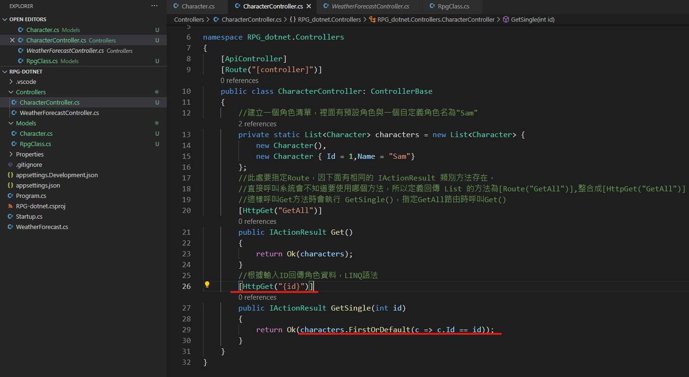
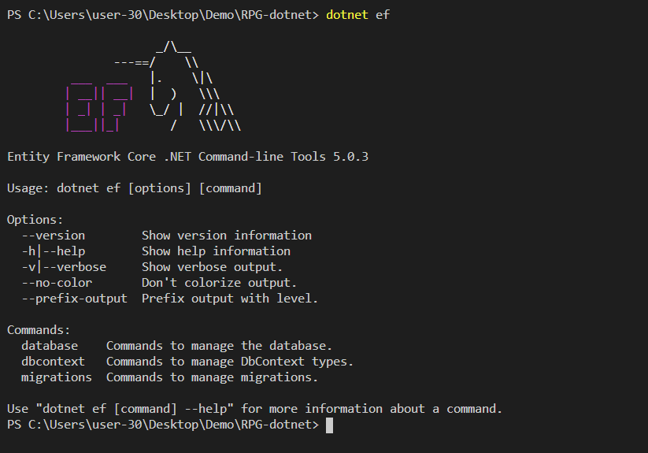

# Dotnet簡介

## MVC介紹

1. 透過Model更新View，使用者透過View介面查看更新資訊
2. 使用Controller控制Model
3. View介面大多使用JS撰寫，可透過API結合前端JS、Angular等創造使用者觀看介面
4. 使用者透過View操作Controller更新Model，藉此循環

# 開始

## 第一步 (創建新增、刪除、修改、查詢方法)

1. 創建Model資料夾，裡面創建各種會使用到的分類，例如 : 角色資料-指定角色屬性

2. 創建Controller來控制Model裡的參數

   

3. 將方法修改下，改成使用ID呼叫角色資料

   

4. 添加查詢方法，透過HttpPost與Json格式傳遞資料(利用PostMan功能)

   

5. 為了整合功能，創建資料夾 Services / CharacterService / CharacterService.cs , ICharacterService.cs

   1. ICharacterService為介面(Interface)，裡面定義需要的功能並由Class去繼承並實作

      

   2. CharavterService類別繼承ICharacterService並實作其功能

      

      > 介面(Interface)就類似於老闆，出一張嘴要你與客戶簽約、談需求、設計產品、提供服務等，而需要一個類別(Class)等同於員工去實作，當類別繼承介面後，如沒有實作完全部方法，編譯器會報錯

   3. 建立完後需到Startup.cs中添加引用外部服務，系統只承認Controller內的功能，如引用到外部資料須至Startup內宣告

      

   4. 需在其中加上Task，並等待資料回傳，在CharacterController、CharacterService中加入async (先知道就好C#異步開發再找時間學)

      https://docs.microsoft.com/zh-tw/dotnet/api/system.threading.tasks.task?view=net-5.0

      

      

      

6. 建立Model / ServiceResponse.cs，用於顯示資料回傳狀態

   1. 建立一個 泛型Class 接收回傳資料

      

   2. 在CharacterService,ICharacterService中的 Task<> 內加入ServiceResponse資料型態

      > 實作ServiceResponse接收並回傳資料，替代原本的newCharacter回傳值 (黃底部分)

      

      

   3. 創建 Dtos/GetCharacterDto,AddCharacterDto，此目的用於接收伺服端的回傳資料，而不讓使用者直接獲取伺服端的值

      

   4. 並更改ICharacterService,CharacterService,CharacterController中Task<>的資料型別

      

      

   5. 安裝AutoMapper封包，dotnet add package AutoMapper.Extensions.Microsoft.DependencyInjection
      會多出一個與專案名稱相同的.csproj檔案，代表成功

      

      

   6. 並在Startup.cs中注入AutoMapper使用

      

   7. 創建並使用AutoMapper參數替代CharacterController.cs中的參數

      

   8. 創建一個分類AutoMapperProfile所需的參數連結再一起

      

   9. 修改CharacterService內的Add方法

      
      
   10. 建立修改角色方法
   
       1. 新增介面
   
       2. 實作介面
   
       3. 修改參數
   
       4. 如果修改角色的ID不相匹配的話會報錯，所以使用try-catch方式接收錯誤訊息防止系統崩潰
   
       5. 到CharacterController中新增修改角色Route定義為HttpPut，並修改頁面回傳狀態為 error 404,預設是200 OK
   
          
   
       
   
       
   
   11. 建立刪除方法
   
       1. 新增介面
   
       2. 實作介面
   
       3. 添加功能
   
       4. 指定HttpDelete
   
          
   
          
   
          

## 第二步 (創建資料庫)

1. 安裝 EFCore

   

2. 安裝entity framework tool讓我們可以使用entity framework

   
   
   
   
3. 輸入 dotnet ef 指令啟動EF

   

4. 下載SQL Server2019 Express

5. 設定登入檔

   

   

